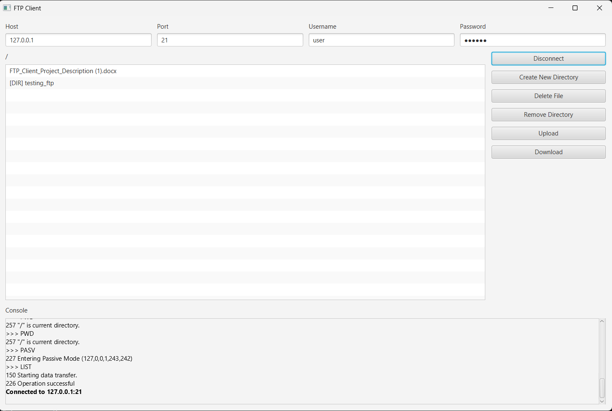

# FTP_Client

A lightweight Java FTP client with a JavaFX GUI. This project demonstrates a simple FTP protocol implementation (control + passive data connections) and a small UI for browsing and manipulating remote directories and files.

## Screenshot



**Location:** [README.md](README.md)

## Features
- Connect to FTP servers (plain FTP) and browse remote directories.
- Common operations: list, change directory, create directory (MKD), remove directory (RMD), delete file (DELE), upload (STOR), download (RETR).
- Passive (PASV) data connection with fallback to control host when needed.
- Simple JavaFX UI with host/port/username/password fields, remote listing, action buttons and a log console.

## Project Structure
- `src/main/java/trietdao/ftp_client/` – application sources
  - `FtpClient.java` – FTP protocol implementation (control socket + passive data sockets)
  - `FtpReply.java`, `FtpReplyCodes.java` – reply parsing and constants
  - `Controller.java`, `Application.java`, `Launcher.java` – JavaFX UI and controller
- `src/main/resources/trietdao/ftp_client/view.fxml` – UI layout
- `pom.xml` – Maven build file

## Requirements
- Java 17+ (JDK). The project has been built and tested with later JDKs as well.
- Maven 3.6+
- JavaFX is provided via the project's `pom.xml` (no separate install required if running via the project's Maven plugin or the provided run configuration).

Note: This implementation is intentionally small and uses only these standard libraries (besides JavaFX):
- `java.io.*`
- `java.net.*`
- `java.util.*`

## Build
From the project root run:

```bash
mvn -DskipTests package
```

This compiles the code and produces `target/FTP_Client-1.0-SNAPSHOT.jar` (if packaging is configured). The project also supports running directly from the compiled classes.

## Run
You can run the application in two common ways:

- Using Maven (recommended if the pom includes JavaFX plugin):

```bash
mvn -DskipTests javafx:run
```

- Or from the command line after compiling:

```bash
mvn -DskipTests compile
java -m trietdao.ftp_client/trietdao.ftp_client.Launcher
```

Alternatively, run the `Launcher`/`Application` from your IDE (module support required).

## Usage
- Fill in the `Host`, `Port`, `Username`, and `Password` fields and click `Connect`.
- Double-click a directory to open it. Use the buttons to create directories, delete files, remove directories, upload and download files.
- The bottom console displays connection and operation logs.

## Troubleshooting
- `Connect failed: Login failed: 503 Use AUTH first.`
  - This means the server requires TLS (explicit FTPS) before `PASS`. FileZilla Server can be configured to allow explicit FTP over TLS; to connect to such servers the client must send `AUTH TLS` and perform a TLS handshake (explicit FTPS) or connect on the implicit FTPS port (usually 990).
- `RMD failed: 550` (remove directory failed): common causes:
  - The directory is not empty — remove files/subdirectories first.
  - Insufficient permissions for the logged-in user.
  - Incorrect path (use the remote listing to confirm path names).

## Limitations & Notes
- The current `FtpClient` is a plain FTP implementation. FTPS (AUTH TLS) is not implemented yet.
- The GUI currently runs operations synchronously on the JavaFX application thread; long operations can block the UI. A future improvement is to run network ops in background tasks and update the UI on the JavaFX thread.
- This project avoids external FTP libraries on purpose and relies only on core Java networking APIs.

## Development & Contributing
- Follow the existing coding style and keep the dependency set minimal.
- If you want FTPS support, consider implementing `AUTH TLS` with `SSLSocketFactory` or integrating an FTPS-capable client implementation (if external libs become allowed).

## Contact
If you need help running or extending the project, open an issue or contact the maintainer.
